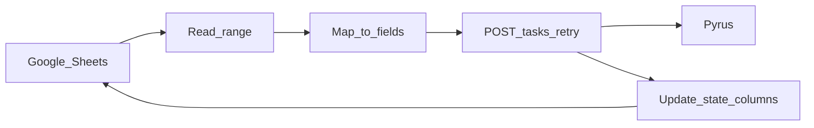

# Интеграция Google Sheets → Pyrus (задачи по форме)

Сервис периодически читает Google Таблицу и для каждой **новой** строки (без ID задачи в Pyrus) создаёт задачу по форме через [Pyrus API v4](https://pyrus.com/en/help/api/tasks).

## Архитектура

- **Python 3.11+**, пакет `pyrus_sheet_sync`.
- **Google Sheets API** (service account): чтение диапазона и запись служебных колонок (ID задачи, статус, ошибка, время обработки).
- **Pyrus**: `POST https://accounts.pyrus.com/api/v4/auth` → `access_token`, затем `POST {api_url}tasks` с `form_id` и `fields`.
- **Идемпотентность**: если в колонке ID задачи уже есть значение, строка пропускается (повторный запуск не создаёт дубликатов).
- **Ошибки по строке**: логируются, в лист пишутся `SyncStatus=error` и текст ошибки; обработка **остальных строк продолжается**. После исправления данных можно снова запустить синк — строка без успешного `task_id` будет повторена.
- **Retry**: до 3 попыток с задержкой 1 / 2 / 4 с при HTTP 429, 5xx и сетевых сбоях; при 4xx (кроме повторной авторизации) ретраев нет.



## Требования

- Учётная запись бота Pyrus: `login` + `security_key` ([Authorization](https://pyrus.com/en/help/api/authorization)).
- Google Cloud проект, включённый Sheets API, **ключ service account** (JSON); таблица расшарена на email сервисного аккаунта с правом **редактора** (нужна запись служебных колонок и опционального листа логов).

## Установка

```bash
cd PyrusSheet_Automation
python -m venv .venv
.venv\Scripts\activate   # Windows
pip install -r requirements.txt
```

Скопируйте [`.env.example`](.env.example) в `.env` и заполните секреты. Скопируйте [`config/mapping.example.yaml`](config/mapping.example.yaml) в `config/mapping.yaml` и настройте лист, колонки и поля формы.

### Переменные окружения

| Переменная | Описание |
|------------|----------|
| `PYRUS_LOGIN` | Email бота Pyrus |
| `PYRUS_SECURITY_KEY` | API-ключ бота |
| `PYRUS_FORM_ID` | Числовой ID формы |
| `SPREADSHEET_ID` | ID таблицы из URL |
| `GOOGLE_APPLICATION_CREDENTIALS` | Путь к JSON ключу SA **или** |
| `GOOGLE_SERVICE_ACCOUNT_JSON` | Содержимое JSON в одну строку |
| `MAPPING_CONFIG_PATH` | Путь к YAML маппинга (по умолчанию `config/mapping.yaml`) |
| `PYRUS_API_URL` | Опционально; обычно приходит из ответа `/auth` |
| `LOG_FILE_PATH` | Опционально: дублирование логов в файл |

## Маппинг (YAML)

- `sheet`: имя листа, строка заголовков (`header_row`, 1-based), последняя читаемая строка `read_to_row`.
- `state`: буквы колонок для `task_id`, `status`, `error`, `processed_at` (заголовки в таблице можно подписать для удобства — код ориентируется на буквы из конфига).
- `field_mappings`: список `{ column: A, id или code/name, type: text|number|date|catalog|... }`. Пустые ячейки в поле не отправляются.
- `task_options`: шаблон темы `subject_template` с плейсхолдерами `{A}`, `{B}`, …; опционально `due_date_column`, `participants_column` (email через запятую).
- `logging.log_sheet_name`: если задано, на этом листе добавляются строки `(время, номер строки, уровень, сообщение)` — создайте лист и при необходимости строку заголовков.

Чтение всегда идёт **с колонки A** до максимальной используемой буквы, чтобы индексы колонок совпадали с `A=0`, `B=1`, …

## Запуск

```bash
# из каталога PyrusSheet_Automation, с заполненным .env
python -m pyrus_sheet_sync --verbose
```

Или с явными аргументами:

```bash
python -m pyrus_sheet_sync --spreadsheet YOUR_ID --mapping config/mapping.yaml
```

Консольная точка входа (после `pip install -e .`):

```bash
pyrus-sheet-sync -v
```

## Периодический запуск

- **Windows Планировщик** / **cron** (Linux): каждые 5 минут вызывать тот же `python -m pyrus_sheet_sync` в каталоге проекта с активированным venv и переменными из `.env`.
- **Google Cloud Scheduler + Cloud Run / Cloud Functions**: собрать образ или задеплоить функцию с тем же кодом, секреты — [Secret Manager](https://cloud.google.com/secret-manager), не в репозитории.

## Демонстрация для приёмки

1. **Успех**: добавить строку с заполненными маппируемыми колонками; запустить синк; убедиться, что в Pyrus создана задача, в служебной колонке записан ID, статус `ok`.
2. **Ошибка валидации**: намеренно испортить значение (например, неверный тип для поля); убедиться, что в логе и колонке ошибки есть сообщение, следующие строки обрабатываются.
3. **Повторный запуск**: снова запустить — успешно обработанные строки не должны порождать новые задачи.

## Тесты

```bash
cd PyrusSheet_Automation
pip install -r requirements.txt
pytest -q
```

## Типы полей Pyrus

Для `text`, `number`/`money`, `date` преобразования заданы в коде. Для **catalog** в ячейке укажите числовой `item_id`. Сложные типы (таблица, многострочные каталоги) настраиваются по [документации полей](https://pyrus.com/en/help/api/fields) — при необходимости расширьте `coerce_value` и YAML под структуру от заказчика.
